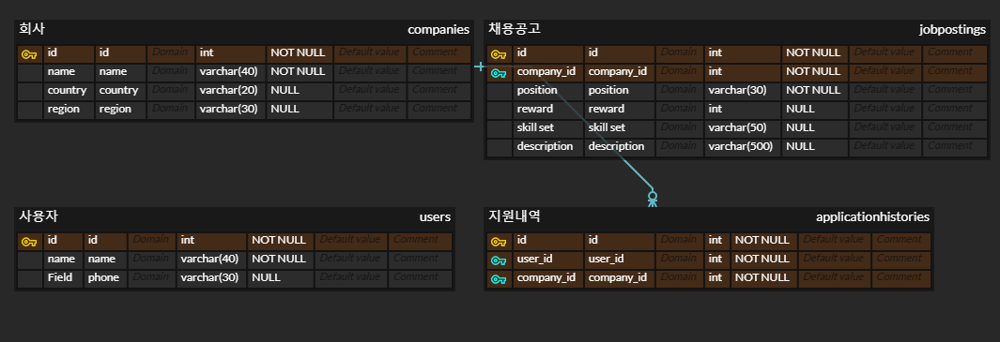

## 원티드 프리온보딩 인턴십 사전과제
---
### 기술 스택
- JAVA 11
- SpringBoot
- MySQL
### 구현 내용

- [x] 채용공고 등록
- [x] 채용공고 수정
- [x] 채용공고 삭제
- [x] 채용공고 목록 조회
- [x] 채용공고 검색
- [x] 채용 상세 페이지 조회
- [x] 사용자의 채용공고 지원

### 테이블 설계

### API 명세
| name       |http method| path                  | param           | request body                                                                                                   | response body                                                                                                                                                                                         |
|------------|---|-----------------------|-----------------|---------------------------|-------------------------------------------------------------------------------------------------------------------------------------------------------------------------------------------------------|
| 채용공고 등록    |post| /posting/create       | None            | {"company_id": 0,"position": "string","reward": 0,"description": "string","skill_set": "string"} | 생성된 postId                                                                                                                                                                                            |
| 채용공고 수정    |put| /posting/{postId}     | postId          | {"position":"backend developer", "reward":10000, "description":"~", "skill_set":"Python"}                      | 수정 성공 여부                                                                                                                                                                                              |
| 채용공고 삭제    |delete| /posting/{postId} | postId          | None    | 삭제 성공 여부                                                                                                                                                                                              |
| 채용공고 목록 조회 |get| /posting              | None            | None      | [{"post_id":post_id, "company_name":company_name, "country":country, "region":region, "position": position, "reward": reward, "skill_set": skill_set}, {}...]                                         |
 | 채용공고 검색    |get| /posting/search       | pageNo, keyword | None | [{"post_id":post_id, "company_name":company_name, "country":country, "region":region, "position": position, "reward": reward, "skill_set": skill_set}, {}]                                            |
| 채용 상세 페이지  |get| /posting/{postId}     | postId| None   | {"post_id":post_id, "company_name":company_name, "country":country, "region":region, "position": position, "reward": reward, "skill_set": skill_set, "description":description, "another_posting":[]} ||

### 구현할 기능 세분화
1.채용공고 등록
- request body 유효성 검사
	- company_id는 유효한 값이어야 한다.
	- reward는 0 혹은 양수의 정수 값이어야 한다.
- job-posting 테이블에 data insert
- response 반환
2. 채용공고 수정
- path variable 유효성 검사
	- postId는 유효한 값이어야 한다.
- request body 유효성 검사
	- reward는 0 혹은 양수의 정수 값이어야 한다.
- job-posting 테이블에서 postId에 해당하는 데이터 update
- response 반환
4. 채용공고 삭제
- path variable 유효성 검사
	- postId는 유효한 값이어야 한다.
5. 채용공고 목록 조회
- 페이지네이션
6. 채용 상세 페이지 조회
- path variable 유효성 검사
	- postId는 유효한 값이어야 한다.

### 구현 과정
1. 채용 공고 등록 기능 구현
    - Company, JobPosting, User entity 구현
    - JobPostingRepository, CompanyRepository 생성
    - JobPostingService에서 JobPosting table에 값을 추가하는 메서드 구현
    - JobPostingController에 `/posting`으로 요청이 올 경우 처리하도록 구현
2. ExceptionHandler, custom ResponseEntity 구현
   - service에서 Exception 발생 시 적절하게 처리하여 Response를 반환하도록 구현
3. 채용 공고 수정 기능 구현
    - JPA의 dirty checking을 이용한 업데이트 구현
4. 채용 공고 삭제 기능 구현
5. 채용 공고 목록 조회
   - 30개 단위로 페이지네이션
6. Dto와 Entity 분리
   - 각 기능별로 필요한 정보만 담아서 전달할 수 있도록 Dto 구현
7. 채용 공고 검색
   - JPA specification을 이용해서 parameter로 전달되는 keyword가 회사명, 포지션, 기술스택에 포함된 경우 조회
   - 30개 단위로 페이지네이션
8. 채용 공고 상세 조회
   - 해당 공고를 작성한 회사의 다른 채용공고 리스트의 id도 같이 조회
9. 채용 공고에 지원하기 
   - 사용자 별로 한 채용공고에 한번만 지원할 수 있도록 구현
